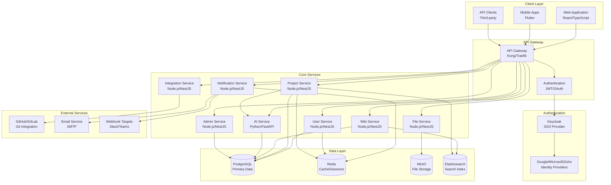
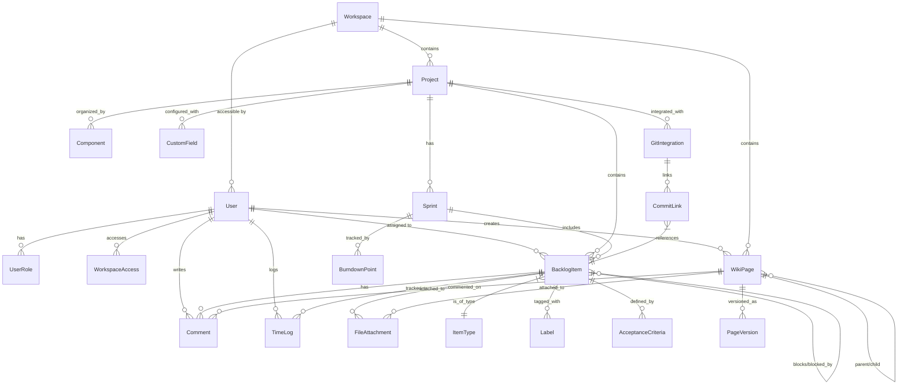

# Design Document

## Overview

Vibely is a comprehensive, self-hosted collaboration platform that combines agile project management and knowledge management capabilities. The system follows a microservices architecture with containerized deployment, supporting the complete software development lifecycle from strategic planning to code deployment.

### Core Design Principles

- **Unified Experience**: Seamless integration between project management and documentation
- **Role-Based Security**: Hierarchical role system with flexible secondary role assignments including Guest access
- **Scalable Architecture**: Microservices design supporting horizontal scaling with 100+ concurrent users
- **Open Source First**: Built with open-source technologies, avoiding vendor lock-in
- **Developer-Centric**: Deep Git integration and development workflow automation
- **Real-Time Collaboration**: WebSocket-based live updates and notifications
- **Multi-Platform**: Web (React) and mobile (Flutter) applications with consistent experience
- **Performance-First**: Sub-second response times with optimized caching and database design
- **Enterprise SSO**: Keycloak-based SSO with Google, Microsoft, and Zoho integration

## Architecture

### High-Level Architecture



### Service Architecture

**Microservices Design Pattern**
- Each service owns its data and business logic
- Services communicate via REST APIs and message queues
- Event-driven architecture for real-time updates
- Independent deployment and scaling capabilities

## Components and Interfaces

### 1. User Management Service

**Responsibilities:**
- User authentication and authorization
- Role hierarchy management (Project Manager → Technical Lead → Developer → Tester/Reviewer)
- Workspace access control
- CSV bulk import functionality

**Key Components:**
```typescript
interface UserService {
  // Authentication
  authenticate(credentials: LoginCredentials): Promise<AuthToken>
  refreshToken(token: string): Promise<AuthToken>
  
  // User Management
  createUser(userData: CreateUserRequest): Promise<User>
  updateUserRoles(userId: string, roles: RoleAssignment): Promise<User>
  bulkImportUsers(csvData: Buffer): Promise<ImportResult>
  
  // Workspace Management
  createWorkspace(workspaceData: CreateWorkspaceRequest): Promise<Workspace>
  assignUserToWorkspace(userId: string, workspaceId: string): Promise<void>
}

interface User {
  id: string
  email: string
  name: string
  primaryRole: Role
  secondaryRoles: Role[]
  workspaces: WorkspaceAccess[]
  isActive: boolean
  lastLogin: Date
}

interface Role {
  type: 'PROJECT_MANAGER' | 'TECHNICAL_LEAD' | 'DEVELOPER' | 'TESTER_REVIEWER' | 'GUEST'
  permissions: Permission[]
  hierarchy: number // 1=highest, 5=lowest (Guest)
}
```

### 2. Project Management Service

**Responsibilities:**
- Backlog item hierarchy management (Initiative → Epic → Feature → Story → Task → SubTask)
- AI-powered ticket generation and breakdown
- Sprint planning and tracking
- Agile boards (Kanban/Scrum)
- Time tracking and reporting
- Custom fields and workflows

**Key Components:**
```typescript
interface ProjectService {
  // Backlog Management
  createBacklogItem(itemData: CreateBacklogItemRequest): Promise<BacklogItem>
  breakdownItem(itemId: string, breakdown: ItemBreakdown): Promise<BacklogItem[]>
  updateItemStatus(itemId: string, status: string): Promise<BacklogItem>
  
  // AI-Powered Generation
  generateTicketsFromDescription(request: AIGenerationRequest): Promise<AIGenerationResult>
  suggestAcceptanceCriteria(itemId: string): Promise<AcceptanceCriteria[]>
  estimateStoryPoints(itemData: BacklogItemData): Promise<StoryPointEstimate>
  suggestTaskBreakdown(storyId: string): Promise<TaskSuggestion[]>
  
  // Sprint Management
  createSprint(sprintData: CreateSprintRequest): Promise<Sprint>
  addItemsToSprint(sprintId: string, itemIds: string[]): Promise<Sprint>
  generateSprintReport(sprintId: string): Promise<SprintReport>
  
  // Board Management
  getBoardView(projectId: string, boardType: BoardType): Promise<BoardView>
  moveItem(itemId: string, fromColumn: string, toColumn: string): Promise<void>
}

interface AIGenerationRequest {
  parentItemId?: string
  description: string
  projectContext: ProjectContext
  userRole: Role
  generationType: 'FULL_BREAKDOWN' | 'STORIES_ONLY' | 'TASKS_ONLY'
  includeAcceptanceCriteria: boolean
  includeEstimation: boolean
}

interface AIGenerationResult {
  generatedItems: GeneratedBacklogItem[]
  confidence: number
  suggestions: AISuggestion[]
  estimatedEffort: EffortEstimate
  warnings: string[]
}

interface GeneratedBacklogItem {
  type: ItemType
  title: string
  description: string
  acceptanceCriteria: AcceptanceCriteria[]
  estimatedStoryPoints?: number
  suggestedAssignee?: string
  dependencies: string[]
  tags: string[]
  priority: Priority
  children?: GeneratedBacklogItem[]
}

interface ProjectContext {
  domain: string // e.g., "e-commerce", "healthcare", "fintech"
  techStack: string[]
  teamSize: number
  previousSimilarItems: BacklogItem[]
  projectGoals: string[]
}

interface BacklogItem {
  id: string
  type: ItemType
  title: string
  description: string
  acceptanceCriteria: AcceptanceCriteria[]
  assignee?: User
  reporter: User
  status: string
  priority: Priority
  storyPoints?: number
  timeTracking: TimeLog[]
  parent?: BacklogItem
  children: BacklogItem[]
  blockers: BacklogItem[]
  blocking: BacklogItem[]
  customFields: CustomField[]
  labels: Label[]
  components: Component[]
  startDate?: Date
  dueDate?: Date
  gitIntegration: GitIntegration
}

interface Sprint {
  id: string
  name: string
  goal: string
  startDate: Date
  endDate: Date
  items: BacklogItem[]
  capacity: number
  velocity: number
  burndownData: BurndownPoint[]
}
```

### 3. Wiki/Knowledge Management Service

**Responsibilities:**
- Wiki page creation and editing
- Hierarchical page organization
- Version control and collaboration
- File attachments and media management

**Key Components:**
```typescript
interface WikiService {
  // Page Management
  createPage(pageData: CreatePageRequest): Promise<WikiPage>
  updatePage(pageId: string, content: string): Promise<WikiPage>
  getPageHistory(pageId: string): Promise<PageVersion[]>
  
  // Hierarchy Management
  organizePage(pageId: string, parentId?: string): Promise<WikiPage>
  getPageTree(workspaceId: string): Promise<PageTree>
  
  // Collaboration
  lockPageForEditing(pageId: string, userId: string): Promise<EditLock>
  getActiveEditors(pageId: string): Promise<User[]>
}

interface WikiPage {
  id: string
  title: string
  content: string
  author: User
  lastModifiedBy: User
  createdAt: Date
  updatedAt: Date
  version: number
  parent?: WikiPage
  children: WikiPage[]
  attachments: FileAttachment[]
  tags: string[]
  permissions: PagePermission[]
}
```

### 4. Integration Service

**Responsibilities:**
- GitHub/GitLab integration
- Webhook management
- Third-party API connections
- Data import/export

**Key Components:**
```typescript
interface IntegrationService {
  // Git Integration
  connectRepository(projectId: string, repoConfig: GitRepoConfig): Promise<GitIntegration>
  handleGitWebhook(payload: GitWebhookPayload): Promise<void>
  linkCommitToItem(commitId: string, itemId: string): Promise<void>
  
  // Webhook Management
  createWebhook(webhookConfig: WebhookConfig): Promise<Webhook>
  triggerWebhook(event: SystemEvent): Promise<void>
  
  // Data Migration
  importFromJira(jiraExport: JiraExportData): Promise<ImportResult>
  exportProject(projectId: string, format: ExportFormat): Promise<ExportData>
}

interface GitIntegration {
  id: string
  projectId: string
  provider: 'GITHUB' | 'GITLAB'
  repositoryUrl: string
  accessToken: string
  webhookUrl: string
  branchMappings: BranchMapping[]
  commitLinks: CommitLink[]
}
```

### 5. Notification Service

**Responsibilities:**
- Real-time WebSocket notifications
- Email notifications
- Notification preferences management
- Event processing and routing

**Key Components:**
```typescript
interface NotificationService {
  // Real-time Notifications
  sendRealtimeNotification(userId: string, notification: Notification): Promise<void>
  subscribeToEvents(userId: string, eventTypes: EventType[]): Promise<void>
  
  // Email Notifications
  sendEmailNotification(notification: EmailNotification): Promise<void>
  processEmailReply(emailData: IncomingEmail): Promise<void>
  
  // Preferences
  updateNotificationPreferences(userId: string, preferences: NotificationPreferences): Promise<void>
}

interface Notification {
  id: string
  type: NotificationType
  title: string
  message: string
  data: any
  recipient: User
  sender?: User
  relatedItem?: BacklogItem | WikiPage
  timestamp: Date
  isRead: boolean
}
```

### 6. AI Service

**Responsibilities:**
- Intelligent ticket generation from high-level descriptions
- Acceptance criteria suggestion based on project context
- Story point estimation using historical data
- Task breakdown recommendations
- Content analysis and suggestions

**Key Components:**
```typescript
interface AIService {
  // Ticket Generation
  generateTicketHierarchy(request: AIGenerationRequest): Promise<AIGenerationResult>
  suggestAcceptanceCriteria(itemDescription: string, projectContext: ProjectContext): Promise<AcceptanceCriteria[]>
  estimateStoryPoints(itemData: BacklogItemData, historicalData: HistoricalData[]): Promise<StoryPointEstimate>
  
  // Content Analysis
  analyzeRequirements(description: string): Promise<RequirementAnalysis>
  suggestTags(itemData: BacklogItemData): Promise<string[]>
  detectDependencies(items: BacklogItem[]): Promise<DependencySuggestion[]>
  
  // Learning and Improvement
  learnFromCompletedItems(completedItems: BacklogItem[]): Promise<void>
  updateEstimationModel(actualEffort: EffortData[]): Promise<void>
}

interface RequirementAnalysis {
  complexity: 'LOW' | 'MEDIUM' | 'HIGH' | 'VERY_HIGH'
  suggestedItemType: ItemType
  identifiedFeatures: string[]
  potentialRisks: string[]
  recommendedApproach: string
  estimatedTimeframe: string
}

interface StoryPointEstimate {
  points: number
  confidence: number
  reasoning: string
  similarItems: BacklogItem[]
  factors: EstimationFactor[]
}

interface EstimationFactor {
  factor: string
  impact: number
  description: string
}

interface DependencySuggestion {
  fromItem: string
  toItem: string
  type: 'BLOCKS' | 'DEPENDS_ON' | 'RELATED'
  confidence: number
  reasoning: string
}
```

### 7. File Management Service

**Responsibilities:**
- File upload and storage
- Version control for files
- Virus scanning and security
- File permissions and sharing

**Key Components:**
```typescript
interface FileService {
  // File Operations
  uploadFile(fileData: FileUploadRequest): Promise<FileAttachment>
  downloadFile(fileId: string, userId: string): Promise<FileStream>
  deleteFile(fileId: string, userId: string): Promise<void>
  
  // Version Management
  createFileVersion(fileId: string, newContent: Buffer): Promise<FileVersion>
  getFileHistory(fileId: string): Promise<FileVersion[]>
  
  // Permissions
  setFilePermissions(fileId: string, permissions: FilePermission[]): Promise<void>
  checkFileAccess(fileId: string, userId: string): Promise<boolean>
}

interface FileAttachment {
  id: string
  filename: string
  mimeType: string
  size: number
  uploadedBy: User
  uploadedAt: Date
  versions: FileVersion[]
  permissions: FilePermission[]
  virusScanResult: ScanResult
  linkedItems: (BacklogItem | WikiPage)[]
}
```

### 8. Admin Service

**Responsibilities:**
- System monitoring and health checks
- User and workspace management
- Backup and restore operations
- Performance analytics and reporting
- System configuration management

**Key Components:**
```typescript
interface AdminService {
  // System Monitoring
  getSystemHealth(): Promise<SystemHealth>
  getPerformanceMetrics(): Promise<PerformanceMetrics>
  getUserActivityReport(dateRange: DateRange): Promise<ActivityReport>
  
  // Backup and Restore
  createSystemBackup(): Promise<BackupResult>
  restoreFromBackup(backupId: string): Promise<RestoreResult>
  scheduleBackup(schedule: BackupSchedule): Promise<void>
  
  // User Management
  bulkUserOperations(operations: BulkUserOperation[]): Promise<BulkOperationResult>
  getSystemUsageStats(): Promise<UsageStats>
  
  // Configuration
  updateSystemSettings(settings: SystemSettings): Promise<void>
  getAuditLogs(filters: AuditLogFilters): Promise<AuditLog[]>
}

interface SystemHealth {
  status: 'HEALTHY' | 'WARNING' | 'CRITICAL'
  services: ServiceHealth[]
  database: DatabaseHealth
  storage: StorageHealth
  performance: PerformanceIndicators
  timestamp: Date
}

interface PerformanceMetrics {
  concurrentUsers: number
  responseTime: ResponseTimeMetrics
  throughput: ThroughputMetrics
  errorRate: number
  resourceUtilization: ResourceUtilization
}

interface BackupResult {
  id: string
  timestamp: Date
  size: number
  status: 'SUCCESS' | 'FAILED' | 'PARTIAL'
  includedServices: string[]
  errors?: string[]
}
```

### 9. SSO Integration Service

**Responsibilities:**
- Keycloak integration and management
- OAuth2/OpenID Connect authentication
- Identity provider configuration
- Token validation and refresh

**Key Components:**
```typescript
interface SSOService {
  // Authentication
  authenticateWithProvider(provider: SSOProvider, code: string): Promise<AuthResult>
  refreshToken(refreshToken: string): Promise<TokenResult>
  validateToken(token: string): Promise<TokenValidation>
  
  // Provider Management
  configureProvider(provider: SSOProviderConfig): Promise<void>
  getProviderStatus(provider: SSOProvider): Promise<ProviderStatus>
  
  // User Mapping
  mapSSOUserToLocal(ssoUser: SSOUserData): Promise<User>
  syncUserFromSSO(userId: string): Promise<User>
}

interface SSOProviderConfig {
  provider: 'GOOGLE' | 'MICROSOFT' | 'ZOHO'
  clientId: string
  clientSecret: string
  redirectUri: string
  scopes: string[]
  isEnabled: boolean
}

interface AuthResult {
  user: User
  accessToken: string
  refreshToken: string
  expiresIn: number
  tokenType: string
}
```

## Data Models

### Core Entity Relationships



### Database Schema Design

**PostgreSQL Tables:**

```sql
-- Users and Authentication
CREATE TABLE users (
    id UUID PRIMARY KEY DEFAULT gen_random_uuid(),
    email VARCHAR(255) UNIQUE NOT NULL,
    name VARCHAR(255) NOT NULL,
    password_hash VARCHAR(255) NOT NULL,
    primary_role user_role NOT NULL,
    is_active BOOLEAN DEFAULT true,
    created_at TIMESTAMP DEFAULT NOW(),
    updated_at TIMESTAMP DEFAULT NOW(),
    last_login TIMESTAMP
);

CREATE TABLE user_roles (
    id UUID PRIMARY KEY DEFAULT gen_random_uuid(),
    user_id UUID REFERENCES users(id) ON DELETE CASCADE,
    role user_role NOT NULL,
    is_primary BOOLEAN DEFAULT false,
    granted_by UUID REFERENCES users(id),
    granted_at TIMESTAMP DEFAULT NOW()
);

-- Workspaces and Projects
CREATE TABLE workspaces (
    id UUID PRIMARY KEY DEFAULT gen_random_uuid(),
    name VARCHAR(255) NOT NULL,
    type workspace_type NOT NULL,
    description TEXT,
    created_by UUID REFERENCES users(id),
    created_at TIMESTAMP DEFAULT NOW(),
    is_active BOOLEAN DEFAULT true
);

CREATE TABLE projects (
    id UUID PRIMARY KEY DEFAULT gen_random_uuid(),
    workspace_id UUID REFERENCES workspaces(id) ON DELETE CASCADE,
    name VARCHAR(255) NOT NULL,
    key VARCHAR(10) UNIQUE NOT NULL,
    description TEXT,
    project_manager_id UUID REFERENCES users(id),
    created_at TIMESTAMP DEFAULT NOW(),
    settings JSONB DEFAULT '{}'
);

-- Backlog Items
CREATE TABLE backlog_items (
    id UUID PRIMARY KEY DEFAULT gen_random_uuid(),
    project_id UUID REFERENCES projects(id) ON DELETE CASCADE,
    parent_id UUID REFERENCES backlog_items(id),
    type item_type NOT NULL,
    title VARCHAR(500) NOT NULL,
    description TEXT,
    status VARCHAR(50) NOT NULL DEFAULT 'TODO',
    priority priority_level NOT NULL DEFAULT 'MEDIUM',
    story_points INTEGER,
    assignee_id UUID REFERENCES users(id),
    reporter_id UUID REFERENCES users(id) NOT NULL,
    start_date DATE,
    due_date DATE,
    created_at TIMESTAMP DEFAULT NOW(),
    updated_at TIMESTAMP DEFAULT NOW(),
    custom_fields JSONB DEFAULT '{}'
);

-- Sprints
CREATE TABLE sprints (
    id UUID PRIMARY KEY DEFAULT gen_random_uuid(),
    project_id UUID REFERENCES projects(id) ON DELETE CASCADE,
    name VARCHAR(255) NOT NULL,
    goal TEXT,
    start_date DATE NOT NULL,
    end_date DATE NOT NULL,
    capacity INTEGER,
    status sprint_status DEFAULT 'PLANNED',
    created_at TIMESTAMP DEFAULT NOW()
);

-- Wiki Pages
CREATE TABLE wiki_pages (
    id UUID PRIMARY KEY DEFAULT gen_random_uuid(),
    workspace_id UUID REFERENCES workspaces(id) ON DELETE CASCADE,
    parent_id UUID REFERENCES wiki_pages(id),
    title VARCHAR(500) NOT NULL,
    content TEXT,
    author_id UUID REFERENCES users(id) NOT NULL,
    last_modified_by UUID REFERENCES users(id),
    version INTEGER DEFAULT 1,
    created_at TIMESTAMP DEFAULT NOW(),
    updated_at TIMESTAMP DEFAULT NOW(),
    is_deleted BOOLEAN DEFAULT false
);

-- File Attachments
CREATE TABLE file_attachments (
    id UUID PRIMARY KEY DEFAULT gen_random_uuid(),
    filename VARCHAR(255) NOT NULL,
    original_filename VARCHAR(255) NOT NULL,
    mime_type VARCHAR(100) NOT NULL,
    file_size BIGINT NOT NULL,
    storage_path VARCHAR(500) NOT NULL,
    uploaded_by UUID REFERENCES users(id) NOT NULL,
    uploaded_at TIMESTAMP DEFAULT NOW(),
    virus_scan_result VARCHAR(20) DEFAULT 'PENDING',
    is_deleted BOOLEAN DEFAULT false
);

-- AI Generation History
CREATE TABLE ai_generations (
    id UUID PRIMARY KEY DEFAULT gen_random_uuid(),
    project_id UUID REFERENCES projects(id) ON DELETE CASCADE,
    user_id UUID REFERENCES users(id) NOT NULL,
    parent_item_id UUID REFERENCES backlog_items(id),
    input_description TEXT NOT NULL,
    generation_type VARCHAR(50) NOT NULL,
    generated_items JSONB NOT NULL,
    confidence_score DECIMAL(3,2),
    user_feedback INTEGER, -- 1-5 rating
    created_at TIMESTAMP DEFAULT NOW(),
    model_version VARCHAR(50)
);

-- AI Learning Data
CREATE TABLE ai_estimation_data (
    id UUID PRIMARY KEY DEFAULT gen_random_uuid(),
    project_id UUID REFERENCES projects(id) ON DELETE CASCADE,
    item_id UUID REFERENCES backlog_items(id) ON DELETE CASCADE,
    estimated_points INTEGER,
    actual_points INTEGER,
    estimated_hours DECIMAL(5,2),
    actual_hours DECIMAL(5,2),
    complexity_factors JSONB,
    created_at TIMESTAMP DEFAULT NOW()
);

-- Project Context for AI
CREATE TABLE project_ai_context (
    id UUID PRIMARY KEY DEFAULT gen_random_uuid(),
    project_id UUID REFERENCES projects(id) ON DELETE CASCADE,
    domain VARCHAR(100),
    tech_stack TEXT[],
    team_size INTEGER,
    project_goals TEXT[],
    similar_projects UUID[],
    updated_at TIMESTAMP DEFAULT NOW()
);
```

## Error Handling

### Error Classification

**1. Client Errors (4xx)**
- `400 Bad Request`: Invalid input data or malformed requests
- `401 Unauthorized`: Authentication required or invalid credentials
- `403 Forbidden`: Insufficient permissions for requested action
- `404 Not Found`: Requested resource does not exist
- `409 Conflict`: Resource conflict (e.g., duplicate email, circular dependencies)
- `422 Unprocessable Entity`: Valid format but business logic validation failed

**2. Server Errors (5xx)**
- `500 Internal Server Error`: Unexpected server-side errors
- `502 Bad Gateway`: Service communication failures
- `503 Service Unavailable`: Service temporarily unavailable
- `504 Gateway Timeout`: Service response timeout

### Error Response Format

```typescript
interface ErrorResponse {
  error: {
    code: string
    message: string
    details?: any
    timestamp: string
    requestId: string
    path: string
  }
}

// Example error responses
{
  "error": {
    "code": "INVALID_ROLE_HIERARCHY",
    "message": "Secondary role cannot be higher than primary role",
    "details": {
      "primaryRole": "DEVELOPER",
      "attemptedSecondaryRole": "PROJECT_MANAGER"
    },
    "timestamp": "2024-01-15T10:30:00Z",
    "requestId": "req_123456",
    "path": "/api/users/roles"
  }
}
```

### Error Handling Strategy

**Service Level:**
- Implement circuit breakers for external service calls
- Retry logic with exponential backoff for transient failures
- Graceful degradation when non-critical services are unavailable
- Comprehensive logging with correlation IDs

**Database Level:**
- Connection pooling with health checks
- Transaction rollback on failures
- Deadlock detection and retry mechanisms
- Data consistency validation

## Testing Strategy

### Testing Pyramid

**1. Unit Tests (70%)**
- Service method testing with mocked dependencies
- Business logic validation
- Data model validation
- Utility function testing
- Target: >90% code coverage

**2. Integration Tests (20%)**
- Service-to-service communication
- Database integration testing
- External API integration testing
- Message queue integration
- Target: All critical integration points covered

**3. End-to-End Tests (10%)**
- Complete user workflows
- Cross-service functionality
- UI automation testing
- Performance and load testing
- Target: All major user journeys covered

### Test Implementation

**Unit Testing Framework:**
```typescript
// Example service test
describe('ProjectService', () => {
  let service: ProjectService
  let mockRepository: jest.Mocked<ProjectRepository>
  
  beforeEach(() => {
    mockRepository = createMockRepository()
    service = new ProjectService(mockRepository)
  })
  
  describe('createBacklogItem', () => {
    it('should create item with proper hierarchy validation', async () => {
      const parentItem = createMockItem({ type: 'EPIC' })
      const childData = { type: 'STORY', parentId: parentItem.id }
      
      mockRepository.findById.mockResolvedValue(parentItem)
      mockRepository.create.mockResolvedValue(createMockItem(childData))
      
      const result = await service.createBacklogItem(childData)
      
      expect(result.parent?.id).toBe(parentItem.id)
      expect(mockRepository.create).toHaveBeenCalledWith(
        expect.objectContaining({ type: 'STORY' })
      )
    })
    
    it('should reject invalid hierarchy relationships', async () => {
      const parentItem = createMockItem({ type: 'TASK' })
      const childData = { type: 'EPIC', parentId: parentItem.id }
      
      mockRepository.findById.mockResolvedValue(parentItem)
      
      await expect(service.createBacklogItem(childData))
        .rejects.toThrow('Invalid hierarchy: EPIC cannot be child of TASK')
    })
  })
})
```

**Integration Testing:**
```typescript
describe('Project Integration Tests', () => {
  let app: INestApplication
  let projectService: ProjectService
  let userService: UserService
  
  beforeAll(async () => {
    const module = await Test.createTestingModule({
      imports: [ProjectModule, UserModule, DatabaseModule]
    }).compile()
    
    app = module.createNestApplication()
    await app.init()
    
    projectService = module.get<ProjectService>(ProjectService)
    userService = module.get<UserService>(UserService)
  })
  
  it('should handle complete project creation workflow', async () => {
    // Create test user with PM role
    const user = await userService.createUser({
      email: 'pm@test.com',
      name: 'Test PM',
      primaryRole: 'PROJECT_MANAGER'
    })
    
    // Create project
    const project = await projectService.createProject({
      name: 'Test Project',
      managerId: user.id
    })
    
    // Create backlog hierarchy
    const epic = await projectService.createBacklogItem({
      projectId: project.id,
      type: 'EPIC',
      title: 'Test Epic'
    })
    
    const story = await projectService.createBacklogItem({
      projectId: project.id,
      type: 'STORY',
      title: 'Test Story',
      parentId: epic.id
    })
    
    expect(story.parent?.id).toBe(epic.id)
    expect(epic.children).toContainEqual(
      expect.objectContaining({ id: story.id })
    )
  })
})
```

## Performance and Scalability

### Performance Requirements

**Response Time Targets:**
- API responses: < 200ms for 95th percentile
- Search queries: < 2 seconds for up to 10,000 documents
- Real-time notifications: < 5 seconds delivery
- File uploads: Support up to 100MB files with progress indicators

**Concurrency Targets:**
- Support 100+ concurrent users per instance
- Horizontal scaling via load balancers
- Database connection pooling (max 50 connections per service)
- Redis caching for frequently accessed data

**Optimization Strategies:**
```typescript
// Caching Strategy
interface CacheStrategy {
  userSessions: '15 minutes'
  projectData: '5 minutes'
  searchResults: '2 minutes'
  staticContent: '24 hours'
}

// Database Optimization
interface DatabaseOptimization {
  indexing: ['user_id', 'project_id', 'created_at', 'status']
  partitioning: 'audit_logs by month'
  archiving: 'completed_items after 2 years'
  connectionPooling: 'per-service pools with health checks'
}
```

### Mobile Application Architecture

**Flutter Mobile Apps:**
- Shared codebase for iOS and Android
- Offline-first architecture with sync capabilities
- Push notifications via Firebase Cloud Messaging
- Biometric authentication support
- Responsive design adapting to tablet/phone form factors

**Mobile-Specific Features:**
```dart
// Mobile API Endpoints
class MobileAPI {
  // Optimized data transfer
  Future<MobileProjectSummary> getProjectSummary(String projectId);
  Future<List<MobileBacklogItem>> getMyItems(int limit, int offset);
  
  // Offline support
  Future<void> syncOfflineChanges();
  Future<bool> isOnline();
  
  // Push notifications
  Future<void> registerForNotifications(String deviceToken);
}
```

### Backup and Disaster Recovery

**Backup Strategy:**
- Automated daily backups of PostgreSQL database
- Incremental backups every 4 hours during business hours
- MinIO object storage replication across availability zones
- Configuration and secrets backup to secure storage

**Recovery Procedures:**
```typescript
interface DisasterRecovery {
  rto: '4 hours' // Recovery Time Objective
  rpo: '1 hour'  // Recovery Point Objective
  
  backupTypes: {
    full: 'daily at 2 AM UTC'
    incremental: 'every 4 hours'
    transaction_log: 'every 15 minutes'
  }
  
  testingSchedule: 'monthly recovery drills'
}
```

### Security Enhancements

**SSO Security:**
- JWT token validation with Keycloak
- Token refresh mechanism with sliding expiration
- Multi-factor authentication support
- Session management with secure cookies

**Data Protection:**
- Encryption at rest for sensitive data
- TLS 1.3 for all communications
- Rate limiting per user/IP
- Input validation and sanitization

This comprehensive design document provides the foundation for implementing Vibely as a complete JIRA + Confluence alternative with all the features specified in our requirements. The architecture is scalable, maintainable, follows modern software development best practices, and addresses all PRD requirements including SSO integration, mobile support, performance targets, and enterprise-grade security.