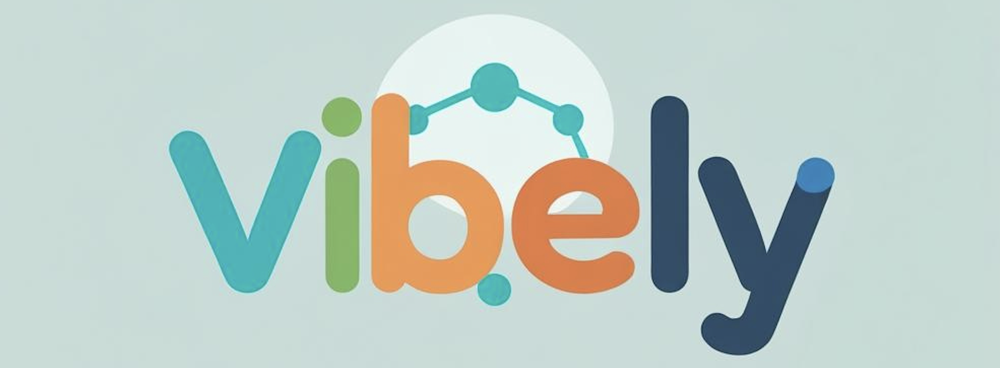

<p align="center">
	<a href="https://www.patreon.com/vibely" target="_blank">
		
	</a>
</p>

<p align="center">
	
</p>

# Vibely

<p align="center">
	<a href="https://github.com/codesteller/vibely/issues">
		
	</a>
	<a href="https://github.com/codesteller/vibely/actions">
		
	</a>
	<a href="https://github.com/codesteller/vibely/blob/master/LICENSE">
		
	</a>
	<a href="https://github.com/codesteller/vibely/graphs/contributors">
		
	</a>
	<a href="https://github.com/codesteller/vibely/stargazers">
		
	</a>
	<a href="https://github.com/codesteller/vibely/network/members">
		
	</a>
	<a href="https://github.com/codesteller/vibely/commits/master">
		
	</a>
	<a href="https://github.com/codesteller/vibely/pulls">
		
	</a>
</p>

Vibely is an open-source, enterprise-grade, all-in-one collaboration platform that seamlessly combines advanced project management (JIRA-like) and knowledge management (Confluence-like) with AI-powered intelligent assistance. Designed for modern teams, Vibely empowers organizations to manage projects, documentation, and workflows in a single, scalable, and self-hosted solution.

## Key Features
- **AI-Powered Project Management:** Break down epics, automate ticket generation, and estimate tasks using intelligent algorithms.
- **Advanced Knowledge Base:** Collaborative wiki with version control, templates, and real-time editing.
- **Agile Boards:** Customizable Kanban/Scrum boards, backlog hierarchy, and sprint management.
- **Role-Based Access Control:** Hierarchical permissions for secure, flexible team management.
- **Real-Time Collaboration:** Instant updates, notifications, and activity feeds.
- **Enterprise Integrations:** GitHub/GitLab, Slack, SSO (Keycloak), and more.
- **Self-Hosted & Open Source:** Full control, no vendor lock-in, and MIT licensed.

## Quick Start
1. **Clone the repository:**
	 ```sh
	 git clone https://github.com/codesteller/vibely.git
	 cd vibely
	 ```
2. **See the [docs](docs/) folder for setup and contribution guides.**

## Contributing
We welcome contributions! Please see [docs/contribution.md](docs/contribution.md) for guidelines.

## License
Vibely is released under the [MIT License](LICENSE).

---

## Community & Support
- [Discussions](https://github.com/codesteller/vibely/discussions)
- [Report a Bug](https://github.com/codesteller/vibely/issues)
- [Request a Feature](https://github.com/codesteller/vibely/issues)

## Roadmap
See [docs/todo.md](docs/todo.md) for upcoming features and progress.

## Security
If you discover a security vulnerability, please see [docs/SECURITY.md](docs/SECURITY.md) for responsible disclosure.

## Changelog
See [Releases](https://github.com/codesteller/vibely/releases) for version history.

## Acknowledgements
Thanks to all [contributors](https://github.com/codesteller/vibely/graphs/contributors) and open-source projects that make Vibely possible.
